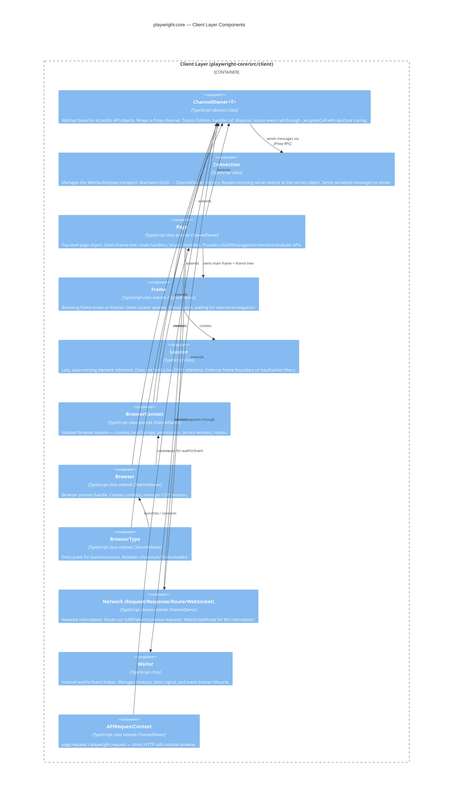
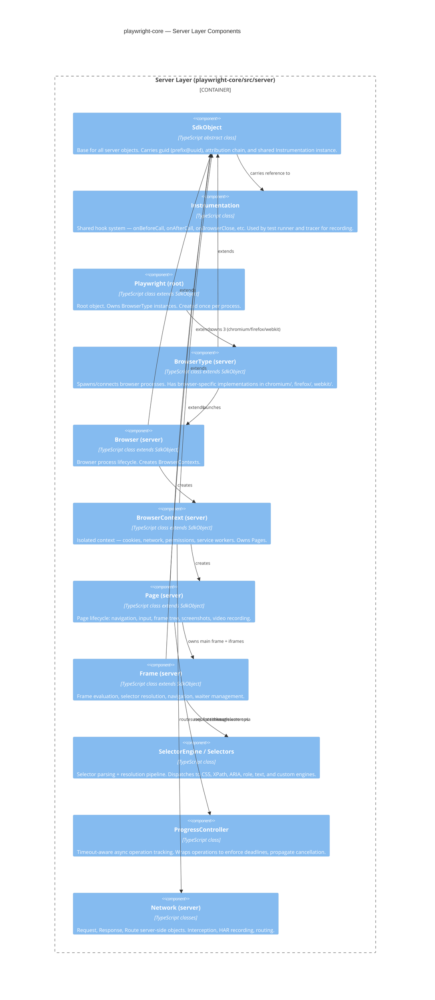
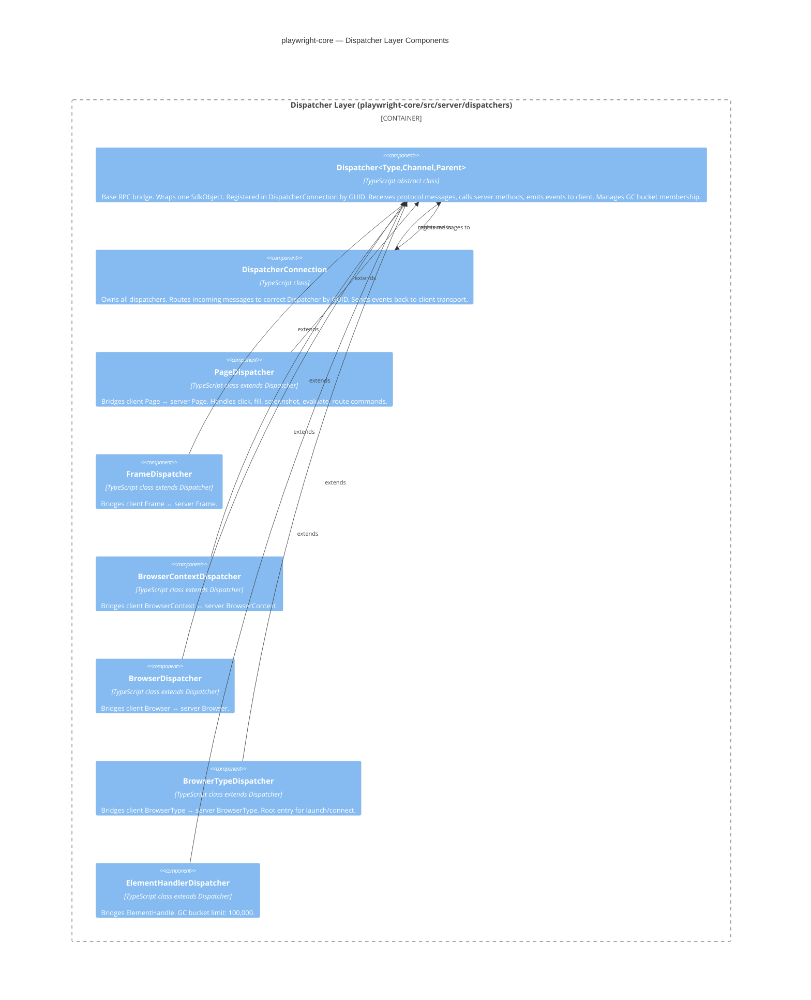
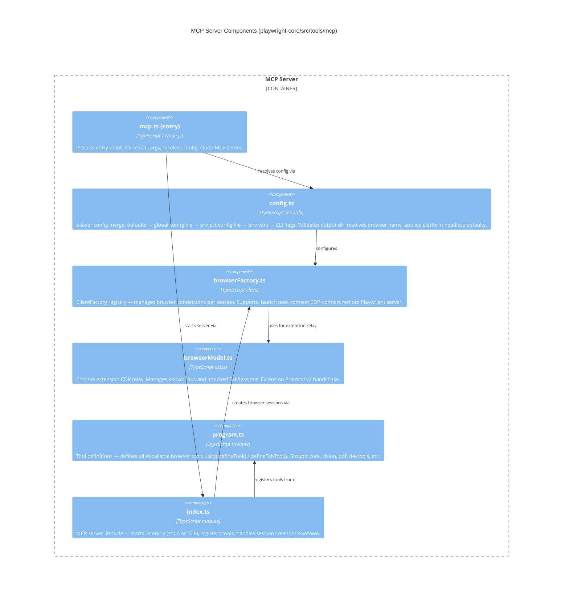
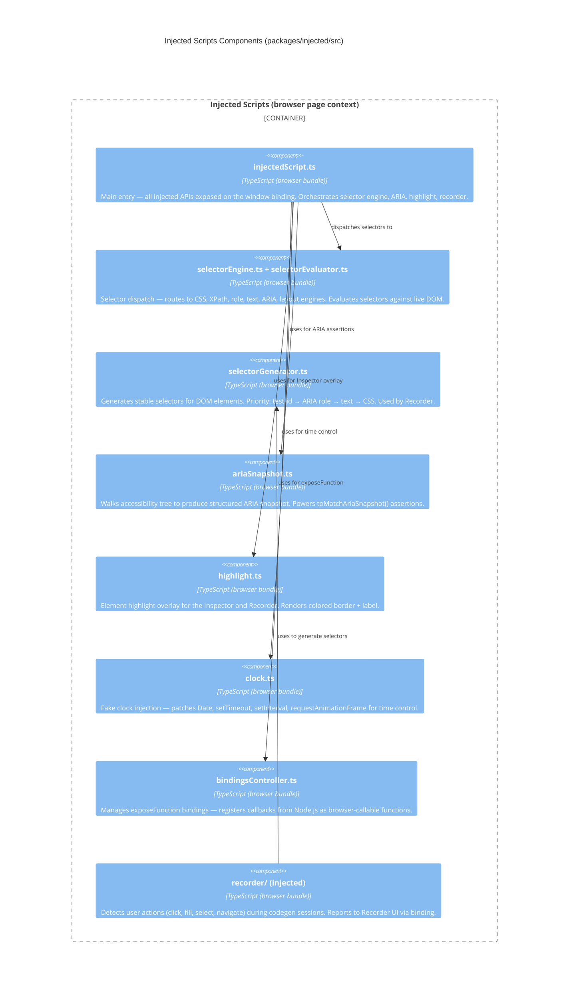

# C4 — Components Diagram (Level 3)

> Generated by Reversa Architect · 2026-06-04
> Focus containers: playwright-core (Client Layer + Server Layer + Dispatcher Layer), MCP Server
> Confidence: 🟢 CONFIRMADO (derived from code-analysis.md, modules.json)

---

## playwright-core — Client Layer Components

---

## playwright-core — Server Layer Components

---

## playwright-core — Dispatcher Layer Components

---

## MCP Server Components

---

## Injected Scripts Components

