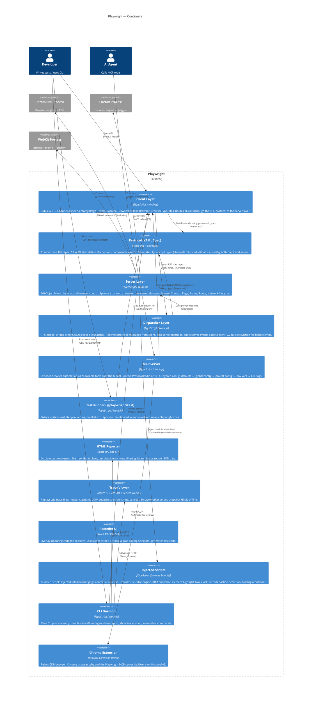

# C4 — Containers Diagram (Level 2)

> Generated by Reversa Architect · 2026-06-04
> Confidence: 🟢 CONFIRMADO (derived from surface.json, inventory.md, code-analysis.md, domain.md)

---

## Description

Playwright's runtime containers are primarily Node.js processes. The core engine (`playwright-core`) implements both client and server in the same npm package; they communicate through an in-process or network RPC channel. The tooling UIs (html-reporter, trace-viewer, recorder) are standalone React SPAs served statically or embedded in the CLI. The MCP server runs as a separate entry-point process exposing browser automation over the Model Context Protocol.

---

## Diagram

---

## Container Summary

| Container | Technology | Deployment | Purpose |
|-----------|-----------|------------|---------|
| Client Layer | TypeScript / Node.js | In-process | Public API (ChannelOwner) |
| Protocol Spec | YAML + codegen | Build-time | Source of truth for RPC contracts |
| Server Layer | TypeScript / Node.js | In-process or separate process | Browser control (SdkObject) |
| Dispatcher Layer | TypeScript / Node.js | In-process | RPC bridge between client and server |
| MCP Server | TypeScript / Node.js | Standalone process | AI agent browser tooling |
| Test Runner | TypeScript / Node.js | Standalone process | @playwright/test |
| HTML Reporter | React 19 SPA | Browser (static) | Test result visualization |
| Trace Viewer | React 19 SPA + SW | Browser (static) | Trace file replay |
| Recorder UI | React 19 SPA | Browser overlay | Codegen recording |
| Injected Scripts | TypeScript (browser bundle) | Browser page context | Selector engine, highlights, clock |
| CLI Daemon | TypeScript / Node.js | CLI process | Command-line interface |
| Chrome Extension | Browser Extension MV3 | Chrome browser | CDP relay for MCP mode |
