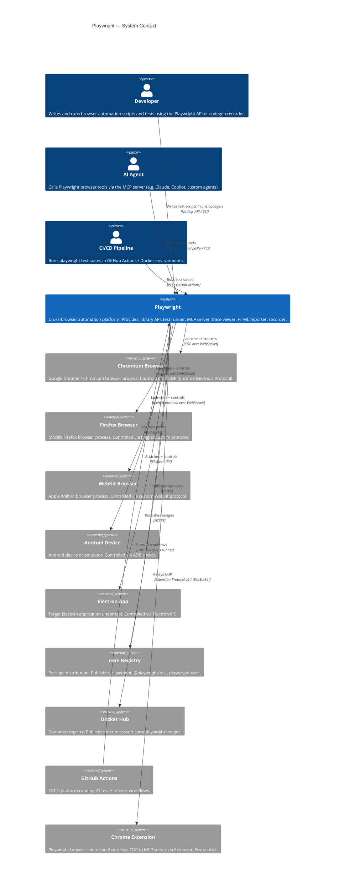

# C4 — Context Diagram (Level 1)

> Generated by Reversa Architect · 2026-06-04
> Confidence: 🟢 CONFIRMADO (derived from surface.json, inventory.md, code-analysis.md)

---

## Description

Playwright is a browser automation platform. It serves three primary user types: human developers writing test scripts, AI agents consuming its MCP server as tooling, and CI/CD pipelines running automated test suites. All automation flows through browser processes (Chromium, Firefox, WebKit) launched or connected by Playwright.

---

## Diagram

---

## External Systems Summary

| System | Type | Protocol | Direction |
|--------|------|----------|-----------|
| Chromium | Browser engine | CDP / WebSocket | Bidirectional |
| Firefox | Browser engine | Juggler / WebSocket | Bidirectional |
| WebKit | Browser engine | Custom / WebSocket | Bidirectional |
| Android Device | Mobile device | ADB socket | Bidirectional |
| Electron App | Desktop app | Electron IPC | Bidirectional |
| Chrome Extension | Browser extension | Extension Protocol v2 | Bidirectional |
| npm Registry | Package registry | HTTPS | Outbound |
| Docker Hub | Container registry | HTTPS | Outbound |
| GitHub Actions | CI/CD | GitHub Actions YAML | Inbound |
| AI Agents (MCP clients) | AI tooling | MCP stdio/TCP | Inbound |
