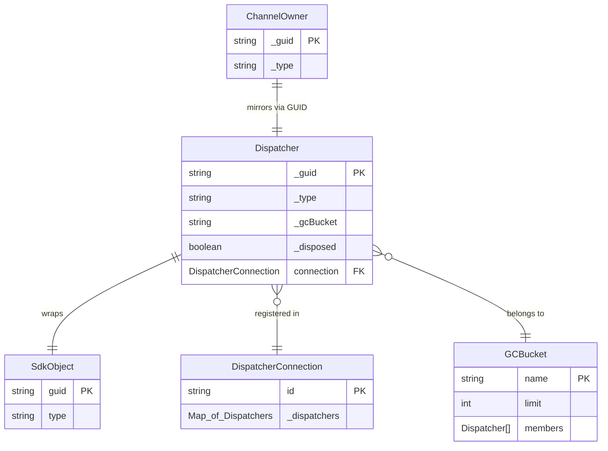
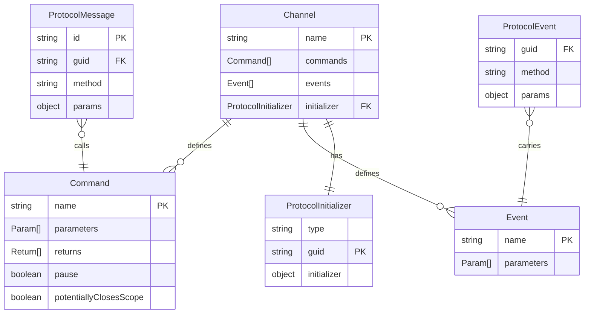
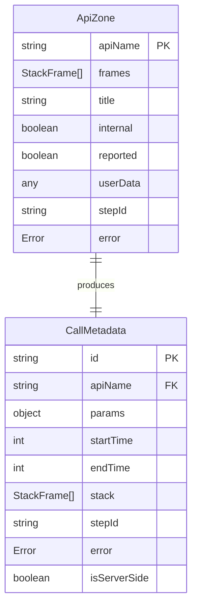
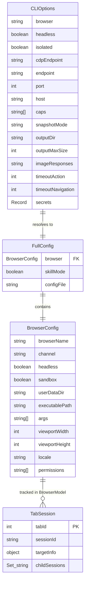

# ERD — Object Model (playwright)

> Generated by Reversa Architect · 2026-06-04
> Note: Playwright has no database. This ERD documents the in-memory runtime object model — the object hierarchy, relationships, and key fields that govern the system's behavior.
> Confidence: 🟢 CONFIRMADO (derived from code-analysis.md, modules.json, domain.md)

---

## Overview

Playwright's object model has two symmetric sides: **client** (`ChannelOwner`) and **server** (`SdkObject`), connected by **Dispatchers** over a GUID-keyed RPC protocol.

---

## Client-Side Object Model

```mermaid
erDiagram
  ChannelOwner {
    string _guid PK
    string _type
    Connection _connection FK
    Proxy _channel
    Map _objects
    boolean _wasCollected
    boolean _disposed
  }

  Connection {
    string _guid
    Map_of_ChannelOwner _objects
    Transport _transport
  }

  BrowserType {
    string _guid PK
    string name
  }

  Browser {
    string _guid PK
    boolean _isConnectedOverWebSocket
    string _browserType FK
  }

  BrowserContext {
    string _guid PK
    string _browserVersion
    string _browser FK
    RouteHandler[] _routes
    Map _bindings
    boolean _closed
  }

  Page {
    string _guid PK
    string _browserContext FK
    Frame _mainFrame FK
    Set_of_Frame _frames
    RouteHandler[] _routes
    Map _locatorHandlers
    boolean _closed
  }

  Frame {
    string _guid PK
    string _page FK
    string _parentFrame FK
    string _name
    string _url
    boolean _detached
  }

  Locator {
    Frame _frame FK
    string _selector
  }

  ElementHandle {
    string _guid PK
    Frame _frame FK
  }

  Request {
    string _guid PK
    string _url
    string _method
    string _resourceType
    string _frame FK
  }

  Response {
    string _guid PK
    Request _request FK
    int _status
  }

  Route {
    string _guid PK
    Request _request FK
  }

  Worker {
    string _guid PK
    string _url
    string _page FK
  }

  APIRequestContext {
    string _guid PK
    string _browserContext FK
  }

  Artifact {
    string _guid PK
    string _absolutePath
  }

  CDPSession {
    string _guid PK
    string _page FK
  }

  ChannelOwner ||--|| Connection : "routes through"
  BrowserType ||--o{ Browser : "launches"
  Browser ||--o{ BrowserContext : "creates"
  BrowserContext ||--o{ Page : "creates"
  BrowserContext ||--o| APIRequestContext : "has"
  Page ||--|| Frame : "main frame"
  Page ||--o{ Frame : "iframe tree"
  Page ||--o{ Worker : "has"
  Page ||--o{ CDPSession : "has"
  Frame ||--o{ Locator : "creates"
  Frame ||--o{ ElementHandle : "creates"
  Request ||--o| Response : "has"
  Request ||--o| Route : "intercepted by"
  Page ||--o{ Artifact : "downloads / videos"
  BrowserType --|{ ChannelOwner : "extends"
  Browser --|{ ChannelOwner : "extends"
  BrowserContext --|{ ChannelOwner : "extends"
  Page --|{ ChannelOwner : "extends"
  Frame --|{ ChannelOwner : "extends"
  ElementHandle --|{ ChannelOwner : "extends"
  Request --|{ ChannelOwner : "extends"
  Response --|{ ChannelOwner : "extends"
  Route --|{ ChannelOwner : "extends"
  Worker --|{ ChannelOwner : "extends"
  APIRequestContext --|{ ChannelOwner : "extends"
  Artifact --|{ ChannelOwner : "extends"
  CDPSession --|{ ChannelOwner : "extends"
```

---

## Server-Side Object Model

```mermaid
erDiagram
  SdkObject {
    string guid PK
    Attribution attribution
    Instrumentation instrumentation
    string logName
  }

  Attribution {
    Playwright playwright FK
    BrowserType browserType FK
    Browser browser FK
    BrowserContext context FK
    Page page FK
    Frame frame FK
    Worker worker FK
  }

  Instrumentation {
    CallbackMap _listeners
  }

  Playwright_Server {
    string guid PK
    BrowserType[] _browserTypes
  }

  BrowserType_Server {
    string guid PK
    string name
    string executablePath
    Playwright_Server _playwright FK
  }

  Browser_Server {
    string guid PK
    BrowserType_Server _browserType FK
    boolean _isConnected
    Map _contexts
  }

  BrowserContext_Server {
    string guid PK
    Browser_Server _browser FK
    Map _pages
    ServiceWorkers[] _serviceWorkers
    NetworkRoutingMap _routes
    Map _bindings
    boolean _closed
  }

  Page_Server {
    string guid PK
    BrowserContext_Server _context FK
    Frame_Server _mainFrame FK
    InputManager _input
    Screenshotter _screenshotter
    VideoRecorder _video
    boolean _closed
  }

  Frame_Server {
    string guid PK
    Page_Server _page FK
    Frame_Server _parentFrame FK
    string _url
    string _name
    string _lifecycleEvents
    boolean _detached
  }

  SdkObject ||--|| Attribution : "carries"
  SdkObject ||--|| Instrumentation : "carries"
  Playwright_Server ||--o{ BrowserType_Server : "owns"
  BrowserType_Server ||--o{ Browser_Server : "launches"
  Browser_Server ||--o{ BrowserContext_Server : "creates"
  BrowserContext_Server ||--o{ Page_Server : "creates"
  Page_Server ||--|| Frame_Server : "main frame"
  Page_Server ||--o{ Frame_Server : "iframe tree"
  BrowserType_Server --|{ SdkObject : "extends"
  Browser_Server --|{ SdkObject : "extends"
  BrowserContext_Server --|{ SdkObject : "extends"
  Page_Server --|{ SdkObject : "extends"
  Frame_Server --|{ SdkObject : "extends"
```

---

## Client ↔ Server Binding (via Dispatcher)



---

## Protocol Message Types (from YAML spec)



---

## ApiZone (Tracing Context — per call)



---

## MCP Config Object Model


