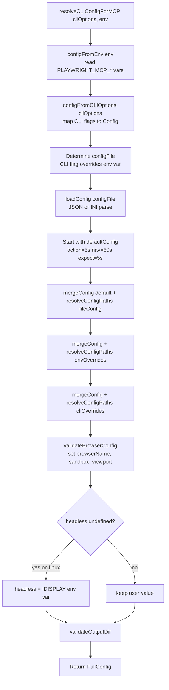
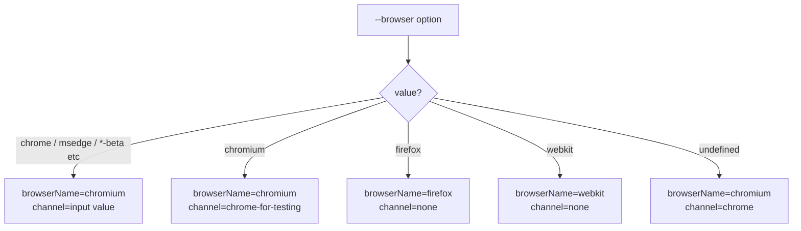
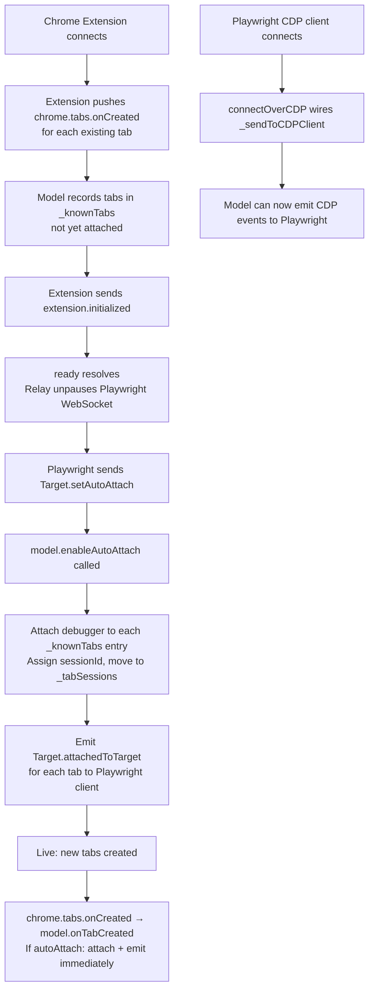

# Flowchart — playwright-core/tools/mcp

> Generated by Reversa Archaeologist · 2026-06-04
> 🟢 CONFIRMADO — extracted from config.ts, browserModel.ts

---

## MCP Config Resolution (resolveCLIConfigForMCP)

---

## Browser Name Resolution

---

## BrowserModel Extension Lifecycle (CDP Relay)

