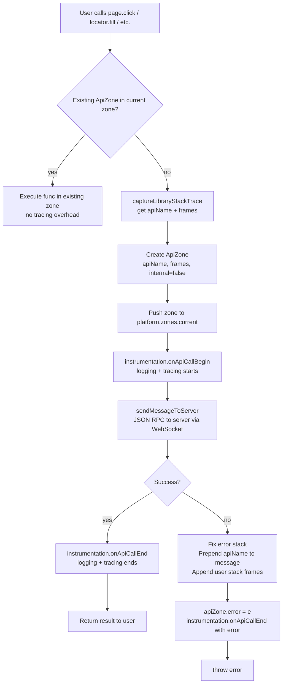
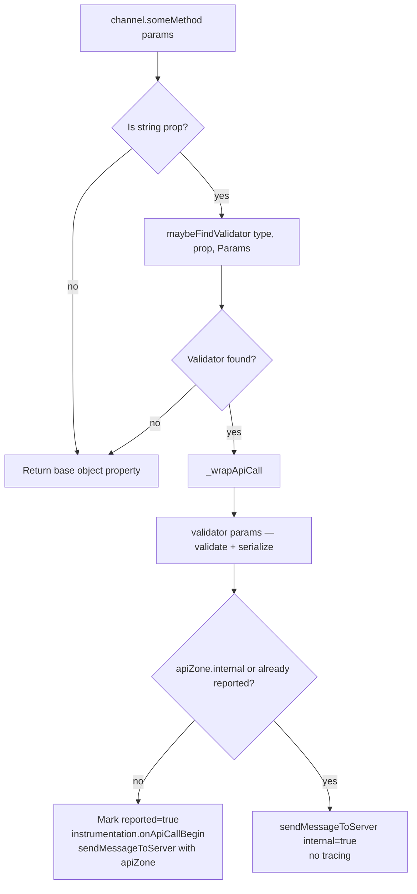
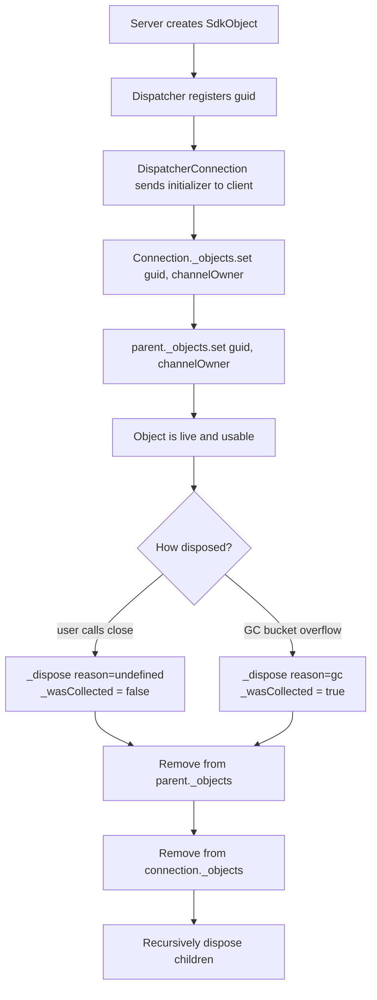
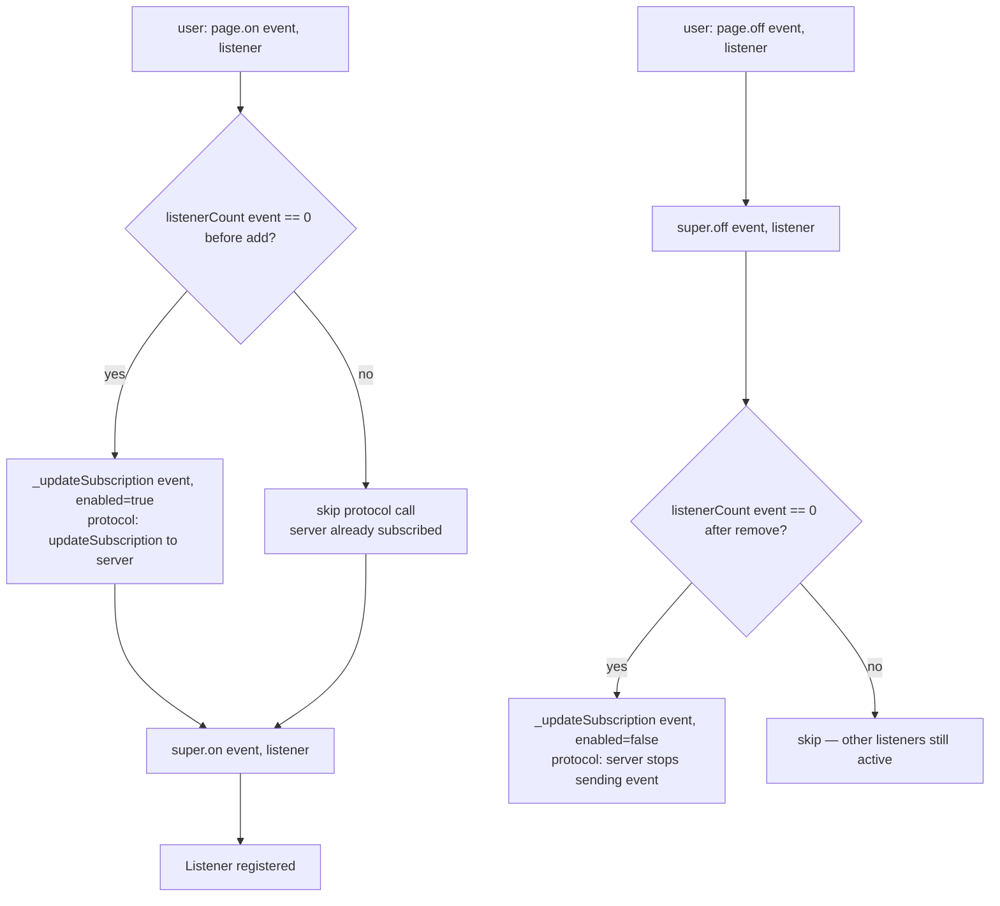

# Flowchart — playwright-core/client

> Generated by Reversa Archaeologist · 2026-06-04
> 🟢 CONFIRMADO — extracted from channelOwner.ts

---

## API Call Flow (ChannelOwner._wrapApiCall)

---

## Channel Proxy Flow (_createChannel)

---

## Object Lifecycle

---

## Event Subscription Management

