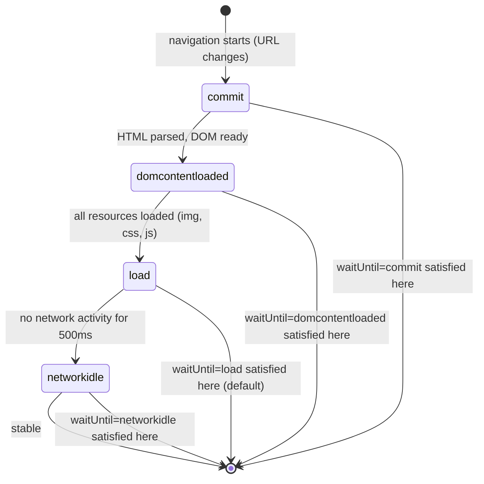
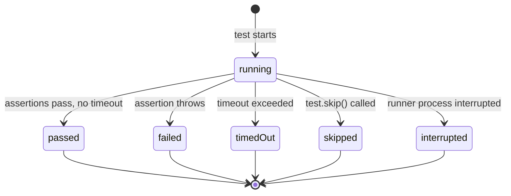
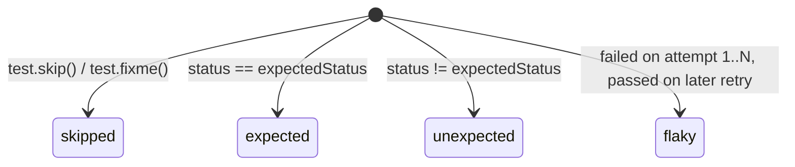
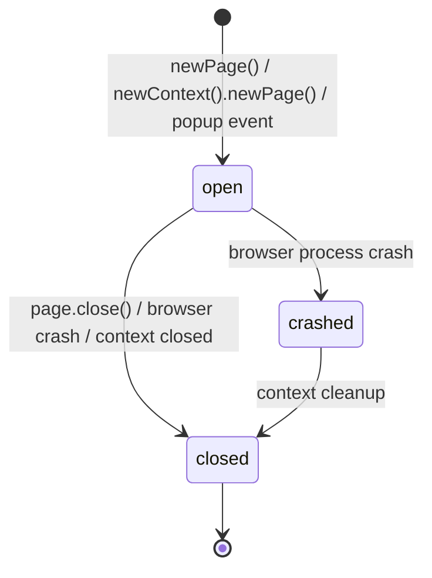
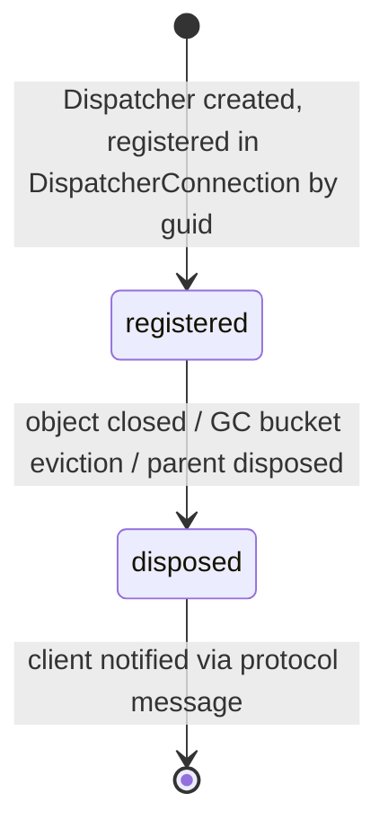
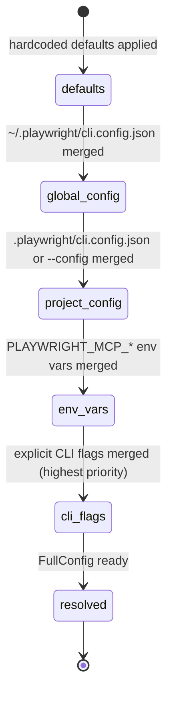

# State Machines — playwright

> Generated by Reversa Detective · 2026-06-04
> doc_level: completo

---

## SM-01 — Frame Navigation Lifecycle

🟢 CONFIRMADO — `packages/protocol/src/channels.d.ts:5112`, `packages/playwright-core/src/server/frames.ts:69`

Tracks how far a page/frame has loaded. States accumulate in order — each fires an event and is added to `_firedLifecycleEvents`.



**Type:** `LifecycleEvent = 'load' | 'domcontentloaded' | 'networkidle' | 'commit'`

**Default `waitUntil`:** `'load'`

**Notes:**
- `networkidle` is excluded from `RegularLifecycleEvent` — it has special handling and is not used in standard wait sequences
- `commit` is the earliest point — URL has committed, DOM not yet parsed
- Events accumulate: once `load` fires, `commit` and `domcontentloaded` are already in `_firedLifecycleEvents`

---

## SM-02 — Element State (Actionability)

🟢 CONFIRMADO — `packages/injected/src/injectedScript.ts:54-56`

An element can be in multiple states simultaneously. Playwright checks specific state combinations before interactions.

```mermaid
stateDiagram-v2
    note right of [*]: States are flags, not exclusive phases
    
    state ElementVisibility {
        visible
        hidden
    }
    
    state ElementInteractability {
        enabled
        disabled
    }
    
    state ElementEditability {
        editable
    }
    
    state CheckboxState {
        checked
        unchecked
        indeterminate
    }
    
    state ElementMotion {
        stable : position unchanged across 2 animation frames
    }
```

**Full type:** `ElementState = 'visible' | 'hidden' | 'enabled' | 'disabled' | 'editable' | 'checked' | 'unchecked' | 'indeterminate' | 'stable'`

**Actionability matrix:**

| Action | Required States | Source |
|--------|----------------|--------|
| click, dblclick, tap | `visible` + `stable` + `enabled` | `dom.ts:583` |
| fill | `visible` + `stable` + `enabled` + `editable` | `dom.ts:615` |
| select text | `visible` + `stable` | `dom.ts:639` |
| scroll into view | `stable` | `dom.ts:231` |
| hover | `stable` | — |

**Retry strategy:** Progressive back-off `[100, 250, 500]` ms between retries, capped at 500 ms. Continues until timeout expires.

---

## SM-03 — Test Result Status

🟢 CONFIRMADO — `packages/playwright/types/test.d.ts:2730`



**Type:** `TestStatus = 'passed' | 'failed' | 'timedOut' | 'skipped' | 'interrupted'`

---

## SM-04 — Test Result Outcome (Reporter View)

🟢 CONFIRMADO — `packages/playwright/types/testReporter.d.ts:291`

Outcome is computed from `expectedStatus` vs actual `status`. Used by reporters, not the test runner itself.



**Type:** `'skipped' | 'expected' | 'unexpected' | 'flaky'`

**Suite-level status** (`TestResult.status`): `'passed' | 'failed' | 'timedout' | 'interrupted'` — note lowercase `timedout` differs from per-test `TestStatus`.

---

## SM-05 — Page Lifecycle

🟢 CONFIRMADO — `packages/playwright-core/src/client/page.ts:80-113`, `packages/protocol/spec/page.yml`



**Key fields:**
- `isClosed: boolean` — sent in Page initializer payload from server
- `_closed: boolean` — client-side flag
- `_closeWasCalled: boolean` — distinguishes explicit `close()` from crash/GC
- `_closedOrCrashedScope: LongStandingScope` — scope that resolves on either event

---

## SM-06 — MCP Tab Session (Extension Mode)

🟢 CONFIRMADO — `packages/playwright-core/src/tools/mcp/browserModel.ts:41-80`

```mermaid
stateDiagram-v2
    [*] --> known : tab observed by extension (tabId added to _knownTabs)
    known --> attached : CDP session assigned (_tabSessions entry created)
    attached --> autoAttached : _autoAttach=true; future tabs skip known phase
    attached --> detached : tab closed or context disposed
    detached --> [*]
```



**Fields:**
- `_knownTabs: Map<number, Tab>` — tabs seen but not yet attached
- `_tabSessions: Map<number, TabSession>` — attached tabs with assigned session IDs
- `_autoAttach: boolean` — once enabled, all new tabs are attached immediately

---

## SM-07 — Dispatcher / SdkObject Lifecycle

🟢 CONFIRMADO — `packages/playwright-core/src/server/dispatchers/dispatcher.ts:52-80`



**GC eviction trigger:** object count in bucket exceeds limit → oldest N dispatchers evicted → `_wasCollected = true` on client-side ChannelOwner.

---

## SM-08 — Config Resolution Pipeline (MCP)

🟡 INFERIDO — `packages/playwright-core/src/tools/mcp/config.ts:115-133`

Not a state machine per se, but a layered override sequence. Each layer can override previous:


